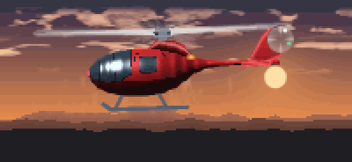

# helikopter

A helicopter flies in your terminal. While it flies, your machine stays awake.

<p align="center">
  
</p>

```
curl -fsSL https://hammadsaedi.github.io/helikopter/install.sh | sh
helikopter
```

A screen-saver that keeps the screen *on*. Press `q` to land.

---

## What it does

- **Flies.** A shaded helicopter over scrolling parallax terrain, with a rotor that
  actually rotates, motion-blurred blades, drifting cloud, rotor downwash and
  blinking navigation lights.
- **Keeps the machine awake.** Holds a real OS wake lock for as long as it runs, on
  macOS, Linux and Windows. Nothing is left behind if it crashes.
- **Makes noise.** The *helikopter helikopter* chant over a rotor bed, or a
  soundtrack generated from scratch with `--synth`. `--silence` turns it off.
- **Costs almost nothing.** ~1% of one core while animating; 0% in `--idle`.

## Install

**macOS / Linux / FreeBSD**

```sh
curl -fsSL https://hammadsaedi.github.io/helikopter/install.sh | sh
```

**Windows** (PowerShell)

```powershell
irm https://hammadsaedi.github.io/helikopter/install.ps1 | iex
```

**Package managers** — not yet published. Manifests for Homebrew, Scoop and
winget are ready in [packaging/](packaging/), but none of them are live, so
`brew install helikopter` will not find anything. Use one of the routes above
until they are.

### Windows and unsigned binaries

The released `helikopter.exe` is **not code-signed**, so Windows may object the
first time it runs:

> Part of this app has been blocked. Some features of Windows PowerShell may not
> work because we can't confirm who published helikopter.exe.

That is Windows reporting that it cannot identify a publisher, not that it found
anything wrong. Two separate mechanisms are involved:

- **SmartScreen** warns about files marked as downloaded from the internet. The
  installer clears that mark with `Unblock-File` once it has verified the
  checksum, so this should not appear when installing through it.
- **Smart App Control**, on Windows 11, blocks unsigned executables regardless
  of where they came from. Nothing an installer can do satisfies it; it needs an
  Authenticode signature.

Until the binaries are signed, the options are to build from source with
`go install`, allow the binary in Windows Security → Protection history, or run
`Unblock-File` on it yourself:

```powershell
Unblock-File "$env:LOCALAPPDATA\helikopter\bin\helikopter.exe"
```

**From source** — needs Go 1.26+:

```sh
go install github.com/hammadsaedi/helikopter/cmd/helikopter@latest
```

The installers download a static binary for your platform, verify it against the
published `checksums.txt`, and drop it in `~/.local/bin` (or
`%LOCALAPPDATA%\helikopter\bin`).

**A particular version**, rather than the latest:

```sh
curl -fsSL https://hammadsaedi.github.io/helikopter/install.sh \
  | HELIKOPTER_VERSION=v1.1.0 sh
```
```powershell
$env:HELIKOPTER_VERSION = "v1.1.0"
irm https://hammadsaedi.github.io/helikopter/install.ps1 | iex
```

The variable has to be on `sh`, not on `curl`. `HELIKOPTER_VERSION=v1.1.0 curl ...
| sh` sets it for the download and not for the script, which then quietly
installs the latest instead — no error, just the wrong version.

That pins the binary but not the script, which is always whatever is on `main`.
Every release from v1.1.3 also carries the installer as it stood at that tag,
already defaulting to its own version, if you want both fixed:

```sh
curl -fsSL https://github.com/hammadsaedi/helikopter/releases/download/v1.1.3/install.sh | sh
```

**Somewhere else on disk**: `HELIKOPTER_BIN_DIR=/usr/local/bin`.

Every released version stays available, so this is also how to go back to one.

## Updating

```sh
helikopter update           # replace this binary with the latest release
helikopter update --check   # say whether an update exists, change nothing
```

`update` downloads the release for your platform, verifies it against the
published checksum, **runs it to confirm it works**, and only then swaps it in.
If any of that fails, nothing is changed and the command you have keeps
working — a self-update that leaves you with no working binary is worse than
one that declines.

It will not escalate privileges. If the binary lives somewhere you cannot write
to, it says so and points at whatever installed it rather than asking for a
password from inside an animation.

Nothing checks on its own. There is no startup check and no background poll: a
program whose claim is that it sits still and costs nothing has no business
making network calls you did not ask for.

If this copy came from somewhere `update` cannot replace, re-run whichever of
these installed it:

```sh
curl -fsSL https://hammadsaedi.github.io/helikopter/install.sh | sh
```
```powershell
irm https://hammadsaedi.github.io/helikopter/install.ps1 | iex
```
```sh
go install github.com/hammadsaedi/helikopter/cmd/helikopter@latest
```

A binary built with `go install` reports its version as `dev`, because there is
no tag baked into it. `update` declines on those rather than guess, and points
you back at `go install`.

To uninstall, delete the binary. It writes no config and leaves nothing behind;
its temp WAV goes when the process does.

## Commands

```
helikopter                  fly
helikopter update [--check] update to the latest release
helikopter version          print version
helikopter themes           list the themes
helikopter help             the full flag list
```

## Usage

```
helikopter                      fly, with sound, keeping the machine awake
helikopter --silence            fly with no sound at all
helikopter --theme night        pick a look
helikopter --theme random       surprise me
helikopter --duration 90m       fly for 90 minutes, then land
helikopter --idle               no animation: just hold the machine awake
helikopter --idle-after 5m      fly for five minutes, then settle into idle
```

### Keys

| key       | does                        |
| --------- | --------------------------- |
| `q`, `^C` | land                        |
| `space`   | pause — stops the sound and the redraw too |
| `t`       | next theme                  |
| `m`       | mute / unmute               |
| `i`       | toggle idle                 |
| `w`       | hold the machine awake, or stop |
| `+` / `-` | resize the helicopter       |

### Flags

| flag              | default   | does                                              |
| ----------------- | --------- | ------------------------------------------------- |
| `-t, --theme`     | `crimson` | colour theme, or `random`                          |
| `--list-themes`   |           | list the themes and exit                           |
| `-s, --silence`   |           | no sound at all                                    |
| `--no-music`      |           | rotor noise only                                   |
| `--volume`        | `70`      | 0–100                                              |
| `--synth`         |           | generated chiptune instead of the recordings       |
| `--sound FILE`    |           | play FILE instead (WAV, looped)                    |
| `--fps`           | `20`      | frames per second                                  |
| `--size`          | `0.78`    | helicopter width as a fraction of the terminal     |
| `--quality`       | auto      | supersampling, 1–2                                 |
| `--ascii`         |           | ASCII shading instead of half-block pixels         |
| `--color`         | `auto`    | `auto`, `never`, `16`, `256`, `true`               |
| `-d, --duration`  |           | fly this long then exit (`90m`, `2h`, or minutes)  |
| `--idle`          |           | wake lock only, no animation                       |
| `--idle-after`    |           | animate this long, then drop to idle               |
| `--no-awake`      |           | do not hold a wake lock                            |
| `--no-display`    |           | let the screen sleep; block system idle sleep only |
| `--seed`          | random    | scenery seed                                       |
| `--snapshot`      |           | print one frame and exit                           |

## Themes

`helikopter --list-themes`

| theme     |                                              |
| --------- | -------------------------------------------- |
| `crimson` | red gunship against a dust-orange dusk (default) |
| `night`   | blacked-out airframe, moonlight and strobes  |
| `sunset`  | warm chrome on a violet-to-amber sky         |
| `arctic`  | search-and-rescue white over a cold blue day |
| `jungle`  | olive drab, low over the treeline            |
| `vapor`   | synthwave: neon grid, pink hull, cyan glass  |
| `matrix`  | phosphor green, everything else black        |
| `mono`    | greyscale, for terminals and purists         |

A theme colours the whole scene, not just the hull — sky gradient, terrain,
cloud, downwash and every material on the airframe. That is why `red` is a theme
and not a flag: crimson only reads well against the right sky.

## Keeping your machine awake

`helikopter` holds a real OS wake lock for its whole lifetime:

| platform | mechanism |
| -------- | --------- |
| macOS    | IOKit power assertions, held in-process |
| Linux    | `systemd-inhibit`, falling back to `gnome-session-inhibit` |
| Windows  | `SetThreadExecutionState`, held on a locked OS thread |

Every mechanism is scoped to the process, so a lock can never outlive it. On
macOS and Windows nothing is spawned at all — the lock lives inside this
process, and the kernel drops it however we exit, `kill -9` included. On Linux
the inhibitor is a child tied to our PID, and `--idle` execs into it directly
rather than supervising it, so idling costs one process rather than two.

On macOS the IOKit framework is bound at runtime instead of through cgo. That
keeps the binary on the small pure-Go runtime and keeps every target
cross-compilable with `CGO_ENABLED=0`.

There is deliberately no `xset s off -dpms` fallback on Linux: it mutates global
X settings and would survive a crash. If no mechanism is available the status
line says `awake unavailable` rather than pretending.

```sh
helikopter --idle               # wake lock only, no animation
helikopter --idle -d 2h         # ...for two hours
helikopter --no-display         # block system sleep but let the screen off
helikopter --no-awake           # animation only, no wake lock (press w to take it)
```

You can confirm it is real:

```
$ pmset -g assertions | grep helikopter
pid 81151(helikopter): PreventUserIdleSystemSleep  named: "helikopter is flying"
pid 81151(helikopter): PreventUserIdleDisplaySleep named: "helikopter is flying"
```

## Cost

`--idle` does no rendering, synthesises no audio and starts no helper process.
It takes the lock, hands the heap back to the OS and blocks on a signal — it
wakes for nothing at all.

Measured on an M3 Pro against the system's own power-management tool:

| | CPU | physical footprint | processes |
| --- | --- | --- | --- |
| system keep-awake tool | 0.0% | 2.2 MB | 1 |
| `helikopter --idle`    | 0.0% | 4.5 MB | 1 |
| `helikopter` animating, 80×24 | ~1.0% | ~5 MB | 1 |

CPU is identical and neither spawns anything. The 2.3 MB difference is the Go
runtime's floor against a small C program; that is the whole of it.

Use *physical footprint*, not `ps` RSS, when comparing these. RSS counts shared
system-library pages in full, so it reports ~14 MB for a process whose private
memory is 4.5 MB — those pages belong to CoreFoundation and are resident for
every application on the machine already.

Animation is kept cheap deliberately:

- The sky gradient and sun are baked once into a background buffer and copied.
- Each cloud band is a ring of pre-shaded columns that scrolls by whole pixels,
  so a steady-state frame evaluates noise for **one new column per band**
  instead of every pixel.
- The fuselage profile is a lookup table; rotor blade positions are computed
  once per frame, not once per pixel.
- Distances are compared squared, so no square roots run in the per-pixel path.
- Only cells that changed are redrawn, and a rendered frame allocates nothing.
- If frames start missing their budget, supersampling drops before frames do.

Together those took a frame from 7.1 ms to 2.2 ms with zero allocations. Turn it
down further with `--fps 10`, `--size 0.5` or `--quality 1`, or use
`--idle-after 5m` to fly for five minutes and then settle into the idle cost
above for as long as you leave it running.

## How the helicopter is drawn

There is no ASCII art in this repository. The airframe is a parametric model —
a fuselage profile, a windscreen curve, polygons for the fin and stabiliser,
segments for the skids — rasterised into a material buffer at whatever
resolution the terminal happens to be, then lit with a real light direction.
Each pixel gets a material (hull, canopy, exhaust, rotor…), a shade and a
specular term; the theme decides what colour those become.

That buys three things a pair of ASCII frames cannot:

- **Shading.** The fuselage is treated as a generalised cylinder, so it has a
  lit top, a shadowed belly and a rim highlight.
- **Real rotation.** The rotor is not a cycle of poses. Blade positions are
  computed from an angle and integrated across a shutter interval, which is
  where the motion blur comes from. The tail rotor is a translucent disc with
  blade shadows sweeping round it.
- **Any size.** It is sharp at 80×24 and sharp full-screen, because it is
  resampled rather than scaled.

Output is half-block glyphs (`▀`), two pixels per cell, so pixels come out
square.

Without Unicode or colour the picture has to be carried by characters instead,
and `--ascii`, `--color never` and `NO_COLOR` switch to a different drawing —
not the same one degraded. Half blocks carry everything in colour, so with
colour off they would be a meaningless wall of `▀`; the ramp is used instead.
Rendering the full scene through a ramp turns the sky into a field of
punctuation, so the sky goes blank, the terrain becomes a horizon line and the
helicopter is remapped into the dense end of the ramp — bright enough that thin
parts like the tail boom cannot drop out and break the silhouette. A cell is
about twice as tall as it is wide, so the model is squashed to match. Where no
theme was named, the greyscale palette is chosen, because it is spaced by
brightness rather than by hue.

```
                              .:::-...
                       .:-==++++++*##==+++++++=+==-..
                                    :%+==--:..   *==.
                                -=++=+*%-       +*-+:
                              =#%#-@%%%*#-      %%=-
                             =@@@%@**%#**##+::-#%%%
                             :++++#***+==.
                 ..           ..::-:::.
       ::::::::---::::::::::::--:::::::::::-::::::::---:::::::::::::::
--------------------------------------------------------------------------------
+++++++++++++++++++++++++++++++++++.....++++++++++++++++++++++++++++++++++++++++
```

To look at the art as pixels rather than escape codes:

```sh
make preview OUT=./preview     # one PNG per theme
make gif                       # regenerate docs/demo.gif and docs/social.png
```

The demo above is rendered by the program itself rather than screen-recorded:
frames come out of the renderer at true terminal resolution — 200 columns by 46
rows — and are scaled by whole pixels, so what you see is exactly what the
terminal draws. The palette is median cut over sampled frames, because a fixed
palette bands the sky and a popularity palette spends every entry on it, the
sky being most of the picture.

## Sound

By default it plays the packaged recordings: the *helikopter helikopter* chant
over a rotor bed, mixed at startup into a single seamless loop. The chant sets
the loop length so the phrase is never cut mid-word, and the rotor is tiled
underneath to fill it.

```sh
helikopter                    # chant + rotor
helikopter --no-music         # rotor only
helikopter --volume 30        # quieter
helikopter --silence          # nothing at all
helikopter --synth            # the generated chiptune instead
helikopter --sound my.wav     # your own file, looped
```

Press `m` to mute while flying. Muting kills the player process rather than
turning the volume down, so muted audio costs nothing. `space` and `i` stop the
sound as well, since nothing is moving to accompany.

Because pausing ends the process rather than suspending it, resuming always
starts the loop again from the beginning — you never rejoin the chant
mid-phrase.

`--synth` generates the soundtrack from scratch rather than playing a
recording — a square-wave hook over a kick, plus rotor noise chopped at the
blade-passing frequency, matched to the animation's 8.6 Hz. It is also the
automatic fallback if the packaged audio ever fails to decode.

The clips ship as **mono 22.05 kHz WAV, not the MP3s they came from**. That is
deliberate: half the playback commands available — `aplay`, `paplay` and
PowerShell's `SoundPlayer` — only understand WAV, so shipping MP3 would have
meant sound on macOS and silence nearly everywhere else. It is also why
`--sound` takes a WAV. The two clips add about 900 KB to the binary.

Playback shells out to whatever the host already has:

| platform | uses | process |
| -------- | ---- | --- |
| macOS    | `afplay` | relaunched each loop |
| Linux    | `paplay`, `pw-play`, `aplay`, `ffplay`, `mpv` or `play` | relaunched each loop |
| Windows  | `winmm.dll` `PlaySound`, in-process | none |

Windows used to launch `powershell.exe` to drive `SoundPlayer`. It worked, but
it was a poor thing for a downloaded binary to do — spawning a shell is a shape
security tooling is right to be suspicious of — and it cost an entire extra
process for a sound that loops itself. `PlaySound` loops natively inside this
process, through the standard library, with no cgo.

If none is found the status line says `sound unavailable` and it flies on in
silence.

### Audio credits

The packaged clips in [internal/audio/assets/](internal/audio/assets/) are
third-party recordings, not original work:

| file | from |
| --- | --- |
| `voice.wav` | `helicopter-helicopter-parakofer-parakofer.mp3` |
| `rotor.wav` | `dragon-studio-helicopter-sound-8d-372463.mp3` |

Both were converted to mono 22.05 kHz WAV. If you intend to publish this
repository, check that their licences permit redistribution and replace the
credits above with the real source and licence — `--synth` and `--sound` exist
so the tool works without them either way.

## Development

```sh
make release VERSION=v1.2.3   # cut a release; see RELEASING.md
```

Or from GitHub: Actions → *release* → *Run workflow*. Both run the same checks.

```sh
make build      # build ./helikopter
make test       # go test ./... -race
make lint       # gofmt + go vet
make bench      # render benchmarks
make preview    # PNGs of every theme
make fly        # build and run
```

Two dependencies: `golang.org/x/term` for terminal size and raw mode, and
`github.com/ebitengine/purego` to bind macOS power management without cgo.
Everything else — rendering, audio synthesis, wake locks, colour quantisation —
is standard library, and every target builds with `CGO_ENABLED=0`.

## History

This started as [43 lines of Python](https://github.com/hammadsaedi/helikopter/tree/legacy)
that alternated two ASCII frames a thousand times. That version is preserved on
the `legacy` branch.

## Licence

MIT
